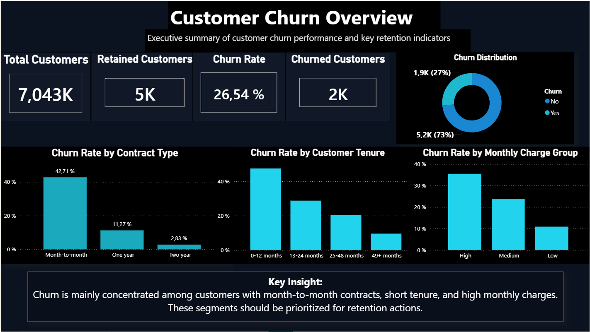
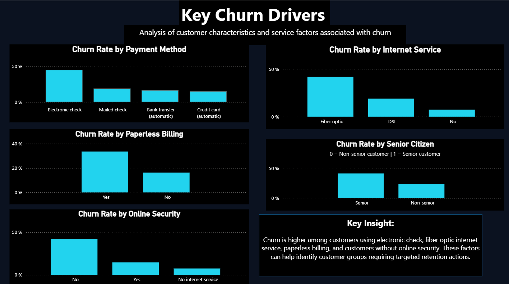
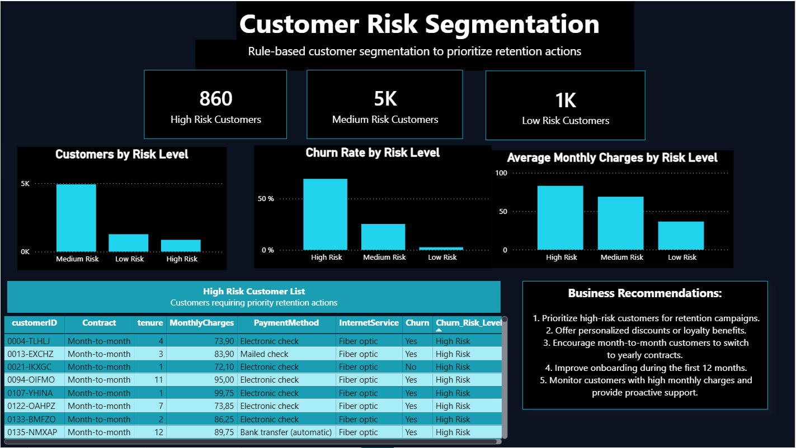

# Customer Churn Analysis BI

## Project Overview

This project analyzes customer churn for a subscription-based company.  
The goal is to identify the main factors associated with customer churn, segment customers by risk level, and provide actionable business recommendations to improve customer retention.

The project includes data cleaning, exploratory analysis, SQL queries, a Power BI dashboard, and business recommendations.

---

## Business Problem

Customer churn directly impacts revenue and long-term business growth.  
For subscription-based companies, understanding why customers leave is essential to improve retention strategies.

This analysis answers the following business questions:

- What is the overall churn rate?
- Which customer segments are more likely to churn?
- How do contract type, tenure, monthly charges, payment method, and internet service influence churn?
- Which customers should be prioritized for retention actions?

---

## Tools Used

- Python
- Pandas
- Matplotlib
- SQL
- Power BI
- Google Colab
- GitHub

---

## Dataset

The dataset contains customer-level information, including:

- Customer ID
- Gender
- Senior citizen status
- Contract type
- Tenure
- Internet service
- Payment method
- Monthly charges
- Total charges
- Churn status

The original dataset was cleaned and enriched with additional columns for analysis:

- `Churn_Flag`
- `Tenure_Group`
- `Monthly_Charge_Group`
- `Churn_Risk_Level`

---

## Project Workflow

### 1. Data Understanding and Cleaning

The dataset was first explored to understand its structure, column types, and data quality issues.

Main cleaning steps:

- Converted `TotalCharges` from text to numeric format
- Removed missing values in `TotalCharges`
- Created a numeric churn indicator
- Created customer tenure groups
- Created monthly charge groups
- Created a rule-based churn risk segmentation

After cleaning, the dataset contained 7,032 customer records.

---

### 2. Business Churn Analysis

The churn analysis focused on identifying the main patterns associated with customer churn.

Main analyses performed:

- Overall churn rate
- Churn rate by contract type
- Churn rate by customer tenure
- Churn rate by monthly charge group
- Churn rate by payment method
- Churn rate by internet service
- Churn rate by online security and other service factors

---

### 3. Customer Risk Segmentation

A rule-based segmentation was created to classify customers into three risk levels:

- High Risk
- Medium Risk
- Low Risk

The segmentation was based on business rules using contract type, tenure, and monthly charges.

High-risk customers showed a significantly higher churn rate, making them a priority segment for retention actions.

---

## Dashboard Overview

The Power BI dashboard contains three pages:

### Page 1 — Executive Overview

This page provides a high-level summary of customer churn performance.

Main visuals:

- Total customers
- Retained customers
- Churned customers
- Churn rate
- Churn distribution
- Churn rate by contract type
- Churn rate by tenure group
- Churn rate by monthly charge group

### Page 2 — Churn Drivers

This page analyzes the main factors associated with churn.

Main visuals:

- Churn rate by payment method
- Churn rate by internet service
- Churn rate by paperless billing
- Churn rate by senior citizen status
- Churn rate by online security

### Page 3 — Risk Segmentation

This page focuses on customer risk segmentation and retention prioritization.

Main visuals:

- Customers by risk level
- Churn rate by risk level
- Average monthly charges by risk level
- High-risk customer list
- Business recommendations

---

## Key Insights

- The overall churn rate is around 26.5%.
- Month-to-month customers have the highest churn rate.
- Customers in their first 12 months are more likely to churn.
- Customers with high monthly charges have a higher churn risk.
- Customers using electronic check show the highest churn rate by payment method.
- Fiber optic customers show a higher churn rate compared to other internet service categories.
- Customers without online security are more exposed to churn.
- High-risk customers have a churn rate close to 70%.

---

## Business Recommendations

1. Prioritize high-risk customers for retention campaigns.
2. Improve onboarding during the first 12 months of the customer relationship.
3. Encourage month-to-month customers to switch to one-year or two-year contracts.
4. Offer personalized discounts or loyalty benefits to customers with high monthly charges.
5. Investigate the customer experience of fiber optic users.
6. Encourage customers using electronic check to switch to automatic payment methods.
7. Provide proactive support to customers without online security or additional support services.

---

## Project Structure

```text
Customer-Churn-Analysis-BI/
│
├── data/
│   ├── raw/
│   │   └── WA_Fn-UseC_-Telco-Customer-Churn.csv
│   └── cleaned/
│       ├── customer_churn_cleaned.csv
│       ├── customer_churn_final.csv
│       └── risk_summary.csv
│
├── notebooks/
│   └── 01_customer_churn_analysis.ipynb
│
├── sql/
│   └── churn_analysis_queries.sql
│
├── dashboard/
│   └── Customer_Churn_Dashboard.pbix
│
├── images/
│   ├── executive_overview.png
│   ├── churn_drivers.png
│   └── risk_segmentation.png
│
├── README.md
└── requirements.txt
